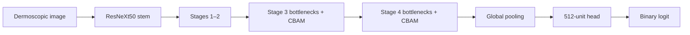

# Melanoma Screening Research: ResNeXt50 + CBAM

[](https://github.com/german-leontiev/melanoma/actions/workflows/quality.yml)

A curated, testable record of a binary dermoscopic-image research project.
The repository preserves the technically verified core—a checkpoint-compatible
ResNeXt50-CBAM architecture, group-aware split utilities and paired evaluation—
without publishing patient images, model weights, credentials or legacy
notebooks.

> Research software only. This project is not a medical device, does not make
> a diagnosis and must not replace examination by a dermatologist,
> dermoscopy or histopathology.

[Русская версия](README.ru.md) · [Live research interface](https://derma.german-leontiev.com)

## What is verified

- CBAM is inserted before the residual addition in every bottleneck of
  ResNeXt stages three and four.
- The public model definition strictly accepts the archived 354-tensor
  checkpoint and produces one binary logit.
- The private PyTorch checkpoint and its production ONNX export returned the
  same class on 100 deterministic ISIC/HAM10000 examples; the largest observed
  probability difference was `2.413988e-06`.
- Manifest splitting keeps every patient or lesion group in exactly one of
  train, validation and test.
- F1/F2 comparison uses paired resampling of the same examples and reports
  uncertainty instead of a bare point estimate.

See [model verification](docs/model-verification.md) for the compatibility
receipt and [legacy results](docs/legacy-results.md) for the historical numbers
and their limitations.

## Architecture



The model definition intentionally matches the archived checkpoint rather than
silently substituting a different attention placement.

## Install

Core data and metric utilities have no third-party runtime dependency:

```bash
python -m pip install -e .
```

Install the PyTorch architecture explicitly:

```bash
python -m pip install -e '.[model]'
```

Development checks:

```bash
python -m pip install -e '.[dev]'
ruff check .
pytest
```

## Leakage-resistant split

Prepare a CSV manifest with one row per image:

```text
sample_id,group_id,label,image_path
ISIC_0000001,patient-001,0,images/ISIC_0000001.jpg
ISIC_0000002,patient-002,1,images/ISIC_0000002.jpg
```

`group_id` must identify the patient or lesion—not the image. Then run:

```bash
melanoma-split manifest.csv --output split.csv --seed 42
```

The command fails if one group has conflicting labels or if a class has fewer
than three independent groups.

## Model construction

```python
from melanoma_research.model import build_model

model = build_model(pretrained=False)
model.eval()
```

No checkpoint loader is provided. PyTorch checkpoint files may execute code
during deserialization; load only a trusted state dict in a controlled
environment. Public weights and datasets are deliberately outside this repo.

## Research interpretation

The archived experiment is evidence of an engineering investigation, not of
clinical superiority. Its 100-image holdout and data provenance are
insufficient for a clinical claim. A publication-quality rerun should use an
immutable patient/lesion-grouped split, an external cohort, preregistered
threshold selection, calibration analysis, sensitivity/specificity with
confidence intervals and subgroup error analysis.

The related CC-2 research manuscript is accepted for publication as of July
2026; until the journal record appears, it should be cited as an accepted
manuscript rather than a published article.

## References

- S. Xie et al., [Aggregated Residual Transformations for Deep Neural
  Networks](https://openaccess.thecvf.com/content_cvpr_2017/html/Xie_Aggregated_Residual_Transformations_CVPR_2017_paper.html), CVPR 2017.
- S. Woo et al., [CBAM: Convolutional Block Attention
  Module](https://www.ecva.net/papers/eccv_2018/papers_ECCV/html/Sanghyun_Woo_Convolutional_Block_Attention_ECCV_2018_paper.php), ECCV 2018.
- P. Tschandl et al., [The HAM10000 dataset](https://doi.org/10.1038/sdata.2018.161), Scientific Data 2018.

## License and data boundary

Code is available under the [MIT License](LICENSE). This license does not cover
ISIC/HAM10000 images, third-party datasets, checkpoints or pretrained weights.
Review the source dataset terms before downloading or redistributing data.
